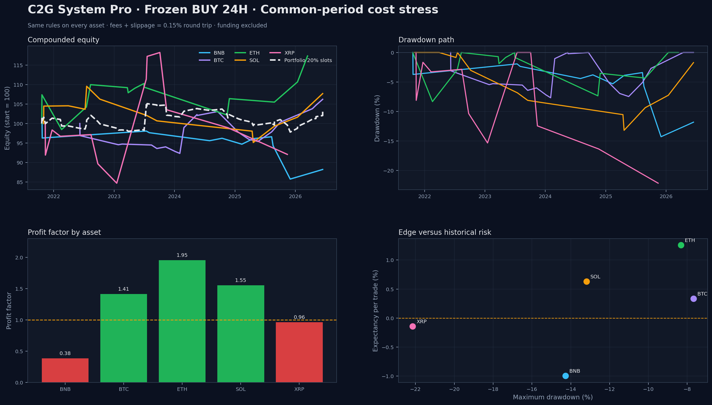

# C2G System Pro

**Build. Test. Fail. Learn. Improve.**

[](https://github.com/froamcodetogold/C2G-System/actions/workflows/ci.yml)

C2G is a public quantitative-research project for cryptocurrency markets. It turns trading ideas into deterministic rules, challenges them across feeds and assets, and keeps historical research separate from frozen forward-paper observation.

> Current stage: **V1 frozen and under forward-paper observation**. No live orders are sent.



## What changed in V1.18

V1.18 hardens the engineering and reporting layer without changing the frozen trading rule:

- exact internal implementations of Supertrend, ADX, ATR and EMA;
- no runtime dependency on `pandas-ta`;
- UTC-normalized OHLCV loading and explicit data-quality audits;
- tested next-open entry and 24-candle exit semantics;
- no-overlap enforcement shared by historical and forward engines;
- append-only forward ledger with immutable closed events;
- canonical multi-exchange and multi-asset backtest runner;
- professional HTML and PNG reports;
- unit tests and historical regression tests;
- GitHub Actions validation and scheduled, read-only forward-paper snapshots.

The historical research scripts remain under `archive/` and are not silently rewritten.

## Frozen strategy

| Component | Frozen rule |
|---|---|
| Timeframe | 1 hour |
| Direction | BUY only |
| Regime | Close above EMA 200 and EMA 200 above its value 50 candles earlier |
| Trigger | Supertrend 10/3 bearish-to-bullish flip |
| Strength | ADX(14) above 25 and rising versus the previous candle |
| Entry | Open of the next candle after the confirmed signal |
| Exit | Close of the 24th held one-hour candle |
| Stop / target | Disabled in frozen V1 |
| Cost stress | 0.055% fee + 0.020% slippage per side; 0.15% round trip |
| Funding | Not included until a validated historical funding dataset is added |

Changing any frozen parameter requires a new research version and a new freeze timestamp.

## Reproduced common-period results

The table below uses the same rule on Bybit perpetual markets over the common period, after the 0.15% round-trip cost stress.

| Asset | Trades | Win rate | Profit factor | Expectancy | Simple return | Max drawdown |
|---|---:|---:|---:|---:|---:|---:|
| BTC | 20 | 50.00% | 1.412 | +0.3366% | +6.73% | -7.68% |
| ETH | 14 | 57.14% | 1.953 | +1.2563% | +17.59% | -8.32% |
| SOL | 13 | 46.15% | 1.553 | +0.6291% | +8.18% | -13.19% |
| XRP | 12 | 41.67% | 0.963 | -0.1435% | -1.72% | -22.15% |
| BNB | 12 | 50.00% | 0.382 | -0.9944% | -11.93% | -14.28% |

These are historical research results, not promises. The sample is small, assets are correlated, and the strategy failed on XRP and BNB after costs.

An unlevered five-slot portfolio proxy (20% per asset) produced a 3.39% compounded historical return, PF 1.163 and -6.95% maximum drawdown. It is a realized trade-level diagnostic, not a production position-sizing model.

## Quick start on Windows

Requirements: Python 3.11 or newer. Python 3.12 is used in continuous integration.

```powershell
py -3.12 -m venv .venv
.\.venv\Scripts\Activate.ps1
python -m pip install --upgrade pip
python -m pip install -e .
```

Run every canonical backtest and rebuild the presentation:

```powershell
python run_all_backtests.py
```

Open the report:

```powershell
start reports\latest\c2g-backtest-report.html
```

The same runner can be called directly:

```powershell
python scripts\run_backtests.py --bootstrap-samples 20000
```

## Backtest outputs

`reports/latest/` contains:

| File | Purpose |
|---|---|
| `c2g-backtest-report.html` | Complete presentation with metrics, charts, method and warnings |
| `c2g-backtest-dashboard.png` | Equity, drawdown, profit factor and risk overview |
| `yearly-returns.png` | Asset-by-year return heatmap |
| `trade-distribution.png` | Distribution of returns per trade |
| `btc-signal-map.png` | Frozen signals in BTC market context |
| `summary.csv` | Metrics for every scope and scenario |
| `trades.csv` | Reproducible trade-level ledger |
| `yearly.csv` | Year-by-year results |
| `outliers.csv` | Top-winner dependency audit |
| `bootstrap.csv` | Bootstrap confidence diagnostics |
| `data_quality.csv` | Gaps, duplicates and source hashes |
| `portfolio_summary.csv` | Equal-slot unlevered portfolio diagnostic |
| `portfolio_equity.csv` | Realized portfolio-proxy equity and drawdown |
| `asset_correlation.csv` | Monthly strategy-return correlation by asset |
| `run_manifest.json` | Engine, parameters, periods and data fingerprints |

## Forward-paper observation

Two profiles are preserved:

| Profile | Freeze UTC | Markets |
|---|---|---|
| V1.14 | 2026-08-15 19:00 | BTC on Binance, Bybit and OKX |
| V1.17 | 2026-08-15 20:00 | BTC, ETH and SOL on Bybit perpetual |

Refresh the Bybit files and update V1.17:

```powershell
python scripts\update_bybit_data.py --forward-only
python c2g_engine_v117_multiasset_true_forward_logger.py
```

Update V1.14 after refreshing all three BTC market files:

```powershell
python c2g_engine_v114_true_forward_paper_logger.py
```

The hardened ledger allows only these transitions:

```text
WAITING_ENTRY -> OPEN -> CLOSED
```

Once an event is `CLOSED`, changes to its entry, exit or PnL raise an integrity error instead of silently rewriting forward evidence.

The scheduled GitHub workflow refreshes BTC/ETH/SOL in its runner every four hours and publishes the V1.17 ledger, summary, and manifest as a 30-day workflow artifact. The job has read-only repository permission and never commits market data or pushes to `main`.

## Validation commands

Run all unit and historical regression tests:

```powershell
python -m unittest discover -s tests -v
```

The regression tests verify that the hardened engine reproduces the frozen reference, including:

- Binance common-period PF near 1.707 after costs;
- Bybit BTC common-period PF near 1.459 after costs;
- cross-asset trade counts and profit factors;
- exact indicator values from the original research implementation.

## Repository structure

```text
C2G-System/
├── .github/workflows/          # CI and scheduled forward-paper jobs
├── archive/                    # preserved historical experiments and outputs
├── reports/latest/             # latest reproducible presentation
├── scripts/                    # backtest, forward and data-refresh commands
├── src/c2g/                    # tested V1.18 engine
│   ├── backtest.py
│   ├── config.py
│   ├── data.py
│   ├── forward.py
│   ├── indicators.py
│   ├── market_data.py
│   ├── portfolio.py
│   ├── report.py
│   ├── strategy.py
│   └── suite.py
├── tests/                      # unit and historical regression tests
├── run_all_backtests.py        # one-command backtest entrypoint
├── pyproject.toml
└── requirements.txt
```

Virtual environments are intentionally excluded. Install dependencies from `pyproject.toml` or `requirements.txt`; never commit a local `venv/` directory.

## Research discipline

C2G follows these rules:

1. Do not optimize away a failed external validation.
2. Do not remove bad years after observing results.
3. Do not select only the highest Profit Factor.
4. Do not confuse historical fit with forward evidence.
5. Do not add indicators without incremental justification.
6. Preserve failed experiments and version history.
7. Include realistic costs and state every omitted cost.
8. Prefer reproducible rules over subjective chart interpretation.
9. Keep research versions separate from frozen forward versions.
10. Treat small and correlated samples with caution.

## What the report does not model

- perpetual funding history;
- order-book depth and execution priority;
- latency, partial fills or exchange outages;
- realistic leveraged portfolio sizing;
- correlated exposure limits for simultaneous assets;
- taxes or asset-specific fee tiers.

These limitations are shown in the report and manifest rather than hidden.

## Roadmap

- **V1 forward:** collect post-freeze evidence without retuning.
- **V2 research:** test one change at a time with walk-forward and threshold-sensitivity analysis.
- **Portfolio layer:** position sizing, correlated-exposure limits and funding-aware returns.
- **MQL5 indicator:** translate only validated signal components.
- **Expert Advisor:** considered only after the signal and risk layers survive forward testing.

## Disclaimer

This repository is for software-engineering, educational and research purposes only. It is not financial or investment advice, a recommendation to buy or sell an asset, or a promise of profitability. Cryptocurrency and leveraged derivatives involve substantial risk. Historical backtests do not guarantee future results.

## License

See [LICENSE](LICENSE).
